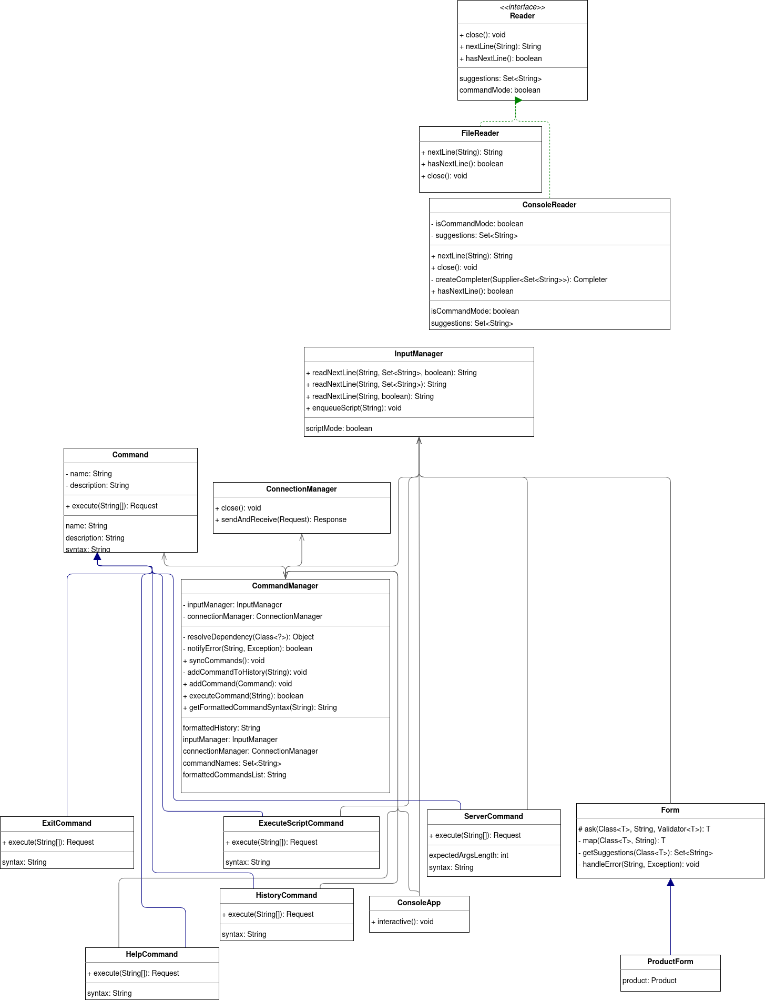
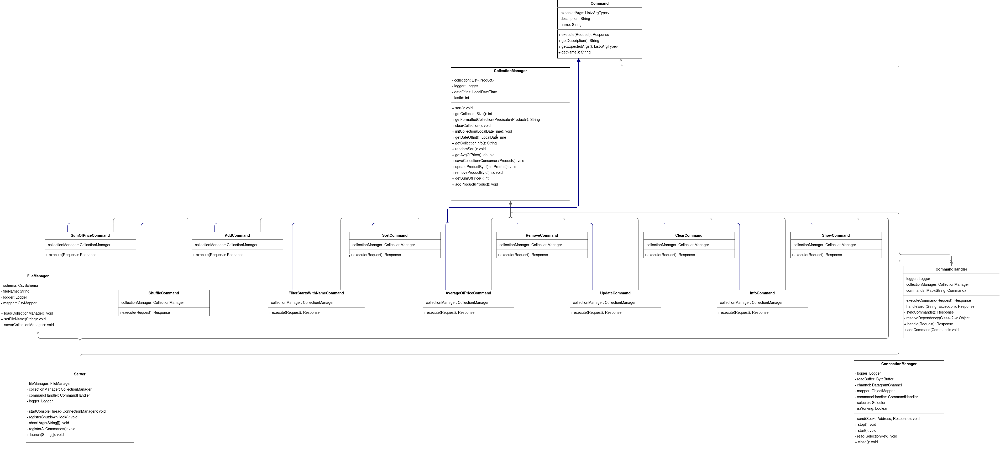

## Вариант 52
Разделить программу из лабораторной работы №5 на клиентский и серверный модули. Серверный модуль должен осуществлять выполнение команд по управлению коллекцией. Клиентский модуль должен в интерактивном режиме считывать команды, передавать их для выполнения на сервер и выводить результаты выполнения.

**Необходимо выполнить следующие требования:**
- Операции обработки объектов коллекции должны быть реализованы с помощью Stream API с использованием лямбда-выражений.
- Объекты между клиентом и сервером должны передаваться в сериализованном виде.
- Объекты в коллекции, передаваемой клиенту, должны быть отсортированы по местоположению
- Клиент должен корректно обрабатывать временную недоступность сервера.
- Обмен данными между клиентом и сервером должен осуществляться по протоколу UDP
- Для обмена данными на сервере необходимо использовать **сетевой канал**
- Для обмена данными на клиенте необходимо использовать **датаграммы**
- Сетевые каналы должны использоваться в неблокирующем режиме.

**Обязанности серверного приложения:**
- Работа с файлом, хранящим коллекцию.
- Управление коллекцией объектов.
- Назначение автоматически генерируемых полей объектов в коллекции.
- Ожидание подключений и запросов от клиента.
- Обработка полученных запросов (команд).
- Сохранение коллекции в файл при завершении работы приложения.
- Сохранение коллекции в файл при исполнении специальной команды, доступной только серверу (клиент такую команду отправить не может).

**Серверное приложение должно состоять из следующих модулей (реализованных в виде одного или нескольких классов):**
- Модуль приёма подключений.
- Модуль чтения запроса.
- Модуль обработки полученных команд.
- Модуль отправки ответов клиенту.

Сервер должен работать в **однопоточном** режиме.

**Обязанности клиентского приложения:**
- Чтение команд из консоли.
- Валидация вводимых данных.
- Сериализация введённой команды и её аргументов.
- Отправка полученной команды и её аргументов на сервер.
- Обработка ответа от сервера (вывод результата исполнения команды в консоль).
- Команду ```save``` из клиентского приложения необходимо убрать.
- Команда ```exit``` завершает работу клиентского приложения.

## Доп задание
Предположим, сервер стал поддерживать новую команду, и теперь нужно дать возможность клиенту делать соответствующий запрос

Ваша задача - реализовать такую логику, чтобы клиент мог общаться с сервером и использовать новую команду без перезапуска

Пример:
1. Сервер выключился
2. Сервер запустился уже с новой командой
3. Клиент подключается к серверу
4. Сервер отправляет информацию о появлении новой команды
5. Клиент может вызывать эту команду

## Расширение функционала клиента
Использованная библиотека - JLine  
Возможности консоли: автокомплит названий команд, файлов и типов данных; история команд

## Диаграмма классов разработанной программы
Клиентская часть:


Серверная часть:
